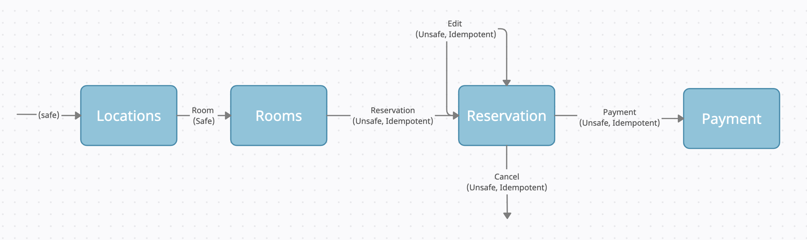

# A Guideline on Writing REST APIs

“REST” APIs are so pervasive these days. Almost all the APIs out there in the internet are described as REST APIs. These include different HTTP verbs and resources unlike traditional RPC like APIs or SOAP based web services. But what if someone says, those are not REST APIs; would you agree or disagree? 

Actually, most REST APIs are semi-REST APIs and at times, don't even reap the full benefits of REST tenets. This article attempts to revive the original REST tenets in pragmatic terms.

This post will be using a reverse order in the sense that it starts with a well-written REST API, which is based on the tenets originally proposed by Roy Fielding, and then ends with a server side discussion on how to implement it. This will help to focus more on the interface of the API than the internal implementation details. 

# User Challenge 

The Snowpeak REST API will be used for this challenge. Snowpeak is a fictional holiday resort in Switzerland which allows users to make room reservations. This is the challenge: say you’ve been asked to complete the goal of making room reservations using the given API. The following information will be given to you to overcome the challenge. 

This service is deployed on Heroku with a free account. Therefore, if you are lucky enough you might be able to try out the challenge as you read the article. This service is written using the Ballerina programming language and the implementation is simply sending back mock responses.

Disclaimer: Please note that some nitty gritty details of the API have been intentionally excluded to keep it simple. Here, the goal is to discuss REST tenets and not to discuss how to write a proper room reservation API.

1. The only well-known URL of the REST API: https://snowpeak-demo.herokuapp.com/snowpeak/locations
2. Relation semantics. The following are the relation semantics for this API.


| Relations    | Description                                                                                           |
|--------------|-------------------------------------------------------------------------------------------------------|
| room         | Refers to a resource that provides information about snowpeak rooms                                   |
| reservation  | Indicates a resource where reservation is accepted                                                    |
| cancel       | Refers to a resource that can be used to cancel the link's context                                    |
| edit         | Refers to a resource that can be used to edit the link's context                                      |
| payment      | Indicates a resource where payment is accepted                                                        |
| service-desc | Identifies service description for the context that is primarily intended for consumption by machines |

A link relation is a string attached to a hypermedia control, which describes the state transition that will occur if the client follows the link. Relation semantics basically explains why you should follow a particular link. 

Note that *edit* and *payment* are [IANA registered relations](https://www.iana.
org/assignments/link-relations/link-relations.xhtml)

## HTTP Idioms
Before solving the challenge, it is expected that as a REST API user, you would understand the basic HTTP verbs such as GET, POST, PUT, DELETE, PATCH and HTTP response status codes such as 200 (OK), 201 (Created), 401 (Conflict), etc. 

## Solving the Challenge 

Solving the challenge would require you to complete a workflow that has multiple steps. Each step will reveal the possible next steps you can take. At each step, you will have to decide which step to take next based on the application semantics.

Think of this challenge as a maze where you have an entry point and an exit point. But you don’t know the path to the exit and your challenge is to figure it out.

Before you start anything, let's get the OpenAPI Specification (OAS) of this service. Well, there are many ways to get the OAS. In the case of Ballerina, you can also get it from the well-known URL as follows and then import it to the [swagger-editor](https://editor.swagger.io/). 

It is much easier to understand the application semantics via swagger-editor than reading the raw OAS. To get the OAS, first you need to send an OPTIONS request to the well-known URL, which results in the below response.


```
HTTP/1.1 204 No Content
allow: OPTIONS, GET, HEAD, POST
date: Thu, 13 Oct 2016 11:45:00 GMT
server: ballerina
link: </snowpeak/openapi-doc-dygixywsw>;rel="service-desc"
```
Now, to get the OAS, you need to send a GET request to the URL in the `link` header. In this case, you can import the OAS to the swagger-editor by giving the discovered URL.

Great, now there is some additional information to play with. Again, remember our goal is to make a room reservation. Let’s start with the well-known URL and see what it has to offer. Doing a get request to that results in the below response. 

```json
{
 "locations": [
   {
     "name": "Alps",
     "id": "l1000",
     "address": "NC 29384, some place, switzerland"
   },
   {
     "name": "Pilatus",
     "id": "l2000",
     "address": "NC 29444, some place, switzerland"
   }
 ],
 "_links": {
   "room": {
     "href": "/snowpeak/locations/{id}/rooms", 
     "types": [
       "application/vnd.snowpeak.resort+json"
     ],
     "methods": [
       "GET"
     ]
   }
 } 
}
```
It seems as per the response Snowpeak offers two locations. If you are interested in taking the first option, as per the link section in the response, the next possible request is again a GET request to the given URL. The relation of the target URL is `room`, which basically hints that this is a link to GET room(s).

That looks like the next step to take or the link to activate/follow to reach our goal. But what are the application semantics related to this request? To figure this out, look for the request with the matching target URL in swagger-editor. You will see all the application semantic details required to follow the target URL. Once you follow the target URL with the relation `room`, you should get the below response.  

```json
{
 "rooms": [
   {
     "id": "r1000",
     "category": "DELUXE",
     "capacity": 5,
     "wifi": true,
     "status": "AVAILABLE",
     "currency": "USD",
     "price": 200,
     "count": 3
   }
 ],
 "_links": {
   "reservation": {
     "href": "/snowpeak/reservations",
     "types": [
       "application/vnd.snowpeak.resort+json"
     ],
     "methods": [
       "PUT"
     ]
   }
 }
}
```
It seems only DELUXE rooms are available but that is fine. The goal is to make a reservation for any room. This time the decision is quite straightforward as there is on target URL with relation `reservation` which probably indicates that you should follow the given link to achieve the goal. Unlike the previous two requests, in this case, the server is suggesting that you need to send a PUT request. Again for application semantics, let’s look for that target URL in swagger-editor.  

You will see that you have all the application semantic information to follow the target URL. In response, you should get the below response.

```json
{
 "id": "re1000",
 "expiryDate": "2021-07-01",
 "lastUpdated": "2021-06-29T13:01:30Z",
 "currency": "USD",
 "total": 400,
 "reservation": {
   "reserveRooms": [
     {
       "id": "r1000",
       "count": 2
     }
   ],
   "startDate": "2021-08-01",
   "endDate": "2021-08-03"
 },
 "state": "VALID",
 "_links": {
   "cancel": {
     "href": "/snowpeak/reservations/{id}",
     "types": [
       "application/vnd.snowpeak.resort+json"
     ],
     "methods": [
       "DELETE"
     ]
   },
   "edit": {
     "href": "/snowpeak/reservations/{id}",
     "types": [
       "application/vnd.snowpeak.resort+json"
     ],
     "methods": [
       "PUT"
     ]
   },
   "payment": {
     "href": "/snowpeak/payments/{id}",
     "types": [
       "application/vnd.snowpeak.resort+json"
     ],
     "methods": [
       "PUT"
     ]
   }
 }
}
```

As in the representation, now you have a reservation ID. The server sends back an array of possible steps you can take. As the next step you can follow `cancel`, `edit` or`payment` options. In this case following the `payment` seems to be the right option as our goal is to reserve a room. So, as the next step, let's follow the `payment` link. Again, semantic details of the target URL can be found in the swagger-editor.

Doing so should result in the below response. 

```json
{
 "id": "p1000",
 "currency": "USD",
 "total": 400,
 "lastUpdated": "2021-06-29T13:01:30Z",
 "rooms": [
   {
     "id": "r1000",
     "category": "DELUXE",
     "capacity": 5,
     "wifi": true,
     "status": "RESERVED",
     "currency": "USD",
     "price": 200,
     "count": 1
   }
 ]
}
```
Above 200 - OK response with room status RESERVED basically lets us know that the room is reserved. Also, as in the previous representation, the server has not sent links to follow. This means we have completed the business workflow. In other words, you have successfully achieved the goal.  

If you look back at the whole experience, it was all about resource representations and a possible set of future state transitions that the user might take. We started with the well-known URL and then at each step, we discovered the possible set of next steps. The server guided us with a self-descriptive set of messages until we reached the goal. Congratulations, what you experienced is a true REST API. 

The experience is quite similar to what you experience when reserving a room via booking.com, agoda.com or any other similar site. None of the staff members of those sites had to explain to you how to make the reservation. It was self-descriptive and all information needed to make right decisions was made available.

The only difference is in the first case you used a JSON form for resource representation, whereas in the second case, they used an HTML form for resource representation. 

In the next section, we will look into the implementation of this REST API, while looking into all the details of REST tenets and its benefits. At the end of the article, you will have all the knowledge to implement proper REST APIs.

# Developer Challenge

As a REST API developer, now you know what sort of user experience you need to provide. It is time to look into how to develop such REST APIs. Before you start, it is important to have some background knowledge on REST. 

## Origin of REST
In the early 1990s, the foundation of the World Wide Web was introduced to share documents in an easy-to-use, distributed, loosely coupled way. Within years, it grew from research and academic sites to fully fledged commercial sites. But have you ever wondered why the web is so ubiquitous? What enabled it to grow so fast? Why is it so successful? 

Roy Fielding did ask those questions in his dissertation “Architectural Styles and the Design of Network-based Software Architectures”, he came up with six constraints to help us build loosely coupled, highly scalable, self-descriptive and unified distributed systems. 

As you noticed in the previous section, there are a lot of similarities between REST APIs and the World Wide Web. I think now you know why. The following are key tenets one needs to keep in mind when designing REST APIs.

- Addressable resources 
- Representation oriented 
- A uniform constrained interface 
- Stateless communication
- Hypermedia As The Engine Of Application State (HATEOAS)

Also it is good to remind ourselves of the technology stack of the World Wide Web as REST API implementations strongly depend on the same stack.


Also it is good to remind ourselves of the technology stack of the Web as REST API implementations strongly depend on the same stack.


URL is used to uniquely identify and address a resource. HTTP is used to describe how to interact with a resource. Hypermedia is used to present what comes next.

## So-Called REST APIs

Ever since the REST architecture pattern was introduced by Roy Fielding in 2000, there has been a massive adoption. People started with RPC and then moved on to use vendor neutral SOAP based web services. Many of those SOAP based web services were converted into REST APIs. Single URL SOAP based web services with multiple SOAP actions were converted into REST APIs with multiple URLs and multiple verbs. However, people didn’t really go all the way and finish off their REST APIs with HATEOAS. A key constraint that is often ignored. The same applies for the newly built so-called REST APIs as well. Therefore, many REST APIs out there are not actually REST APIs. In fact, to make matters worse over time people started using the term “REST” to describe all the none-SOAP services.

Roy Fielding noticed that many are actually calling those types of APIs as REST APIs. [Here](https://roy.gbiv.com/untangled/2008/rest-apis-must-be-hypertext-driven) is what he had to say about it. Therefore, most APIs out there are actually not REST APIs, we are better off calling them maybe Web APIs. Anyway, maybe this is what happens when you come up with a good set of principles but don't bother to enforce them.

## Richardson Maturity Model (RMM)

Richardson came with a nice classification in 2008 to understand the relationship between the Web API and REST constraints. This classification includes four levels. Each level is built on top of the other. 

- Level 0 - Web APIs with one URL and only use POST method
- Level 1 - Web APIs with multiple resources (URLs) but only use POST method
- Level 2 - Web APIs with multiple resources (URLs) and multiple methods such as GET, PUT, POST, DELETE
- Level 3 -  Web APIs with hypermedia as the engine of application state 

As you can see, many Web APIs out there stop at level 2 and that has a profound impact on the API you design. We will get to that in a later section. For more information on RMM check [this article](https://martinfowler.com/articles/richardsonMaturityModel.html). 

## Designing Snowpeak API

The first thing you need to do when designing REST APIs is coming up with a good state diagram. It helps you understand the resources, representations and state transitions. This requires a good understanding of the business context. 

Now let’s start designing the workflow to make the reservation. As you noticed in the first section, users only see representations and a set of next possible requests or state transitions. They don’t actually see the resource itself. Therefore, when drawing the state diagram, it is good to start with the resource representations and state transitions. State transitions do not need to have the exact HTTP verbs, but it is better to note down if the state transition is safe, unsafe and idempotent, unsafe and non-idempotent. The following is the state diagram for Snowpeak reservation API.



Note that the fields in each representation are not listed in each box for brevity. As you can see, there are four resources and multiple state transitions. On each state transition, you can see the relation, which helps us understand why we need to follow a particular state transition. Simply put, states become resources whereas state transitions become relations. If you want, you can exit from the payment but that part is omitted to keep things simple.

Lastly, if you really think about it, it is just a breakdown of hierarchical data linked by relations. 

## Developing Snowpeak API

As mentioned earlier, the Ballerina programming language is used to develop this API. However, concepts discussed here are applicable for any programming language. The fully implemented Snowpeak API is available here. The high level steps of the development is as follows,

1. Define the representations
2. Define the resources 
3. Add HTTP protocol semantics 
4. Add HATEOAS

### Defining the Representations

```ballerina
# Represents locations
type Location record {|
   # Name of the location
   string name;
   # Unique identification
   string id;
   # Address of the location
   string address;
|};
# Represents a collection of locations
public type Locations record {
   *http:Links;
   # collection of locations
   Location[] locations;
};
```

Location has three fields: name, id and address. Each field is documented along with the Location record. Documentation is very important because it helps readers of the code to understand the code better and at the same time it helps API users understand the API as this documentation is mapped into OpenAPI documentation as descriptions. Many developers tend to think of documentation as a second class thing but it is not.

`*http:Links` syntax basically copies fields in the Links record to Locations record. Links record is simply an array of Link records that basically have all the fields related to the hyperlinks. 

Likewise for each representation which goes back and forth between the client and server, there is a defined record. Check the [representation](https://github.com/ballerina-platform/module-ballerina-http/tree/example2/examples/snowpeak/service/modules/representations) module for more information.

#### Domain Specific Media Type

Once all the resource representations are mapped into records, you could see that these representations are specific to the domain of room reservation. To represent the collection of these resource representations we can define a media type. This media type can be used to understand the application semantics of the API. `application/vnd.snowpeak.resort+json` is the media type we have chosen for this domain. Then for the media type usually a media type specification is written to bridge the application semantic gap. Further, the media type could be registered under IANA if needed. 

Users of the API can look up media type and locate the media type specification for application semantics. Here is a [link](http://amundsen.com/media-types/maze/) for a good example of media type specification.

However, the purpose of a media type is to provide application semantics. Application semantics could be also understood using a well-written OpenAPI specification (OAS). Which means instead of depending on the media-type specification to understand the application semantics, you can depend on the OAS of that service. Ballerina automatically generates the OAS from the code itself. Hence, eliminating the need for writing a media-type specification or any other documentation.

Domain specific media-type prefix can be configured in Ballerina HTTP services as follows.

```ballerina
@http:ServiceConfig { mediaTypeSubtypePrefix: "vnd.snowpeak.resort" }
service /snowpeak on new http:Listener(port) {}
```

#### JSON is Not a Hypermedia Format

First of all, what is hypermedia? hypermedia is a way for the server to tell the client what HTTP requests the client might want to make in the future. It’s a menu, provided by the server, from which the client is free to choose. 

Ballerina records are by default serialized into JSON and it is not a hypermedia format such as HTML, HAL, Siren, etc. Ballerina has introduced its own semantics to include hypermedia links in JSON. Even though client tools may not understand those as hyperlinks, humans do which is good enough. Besides those semantics are based on top of the well-known concepts such as `rel`, `href`, `mediatype`, `actions`, which makes it self-descriptive. 

### Defining the Resources

Now that you have resource representations, you can start writing down the resources itself. Ballerina `resource` functions can be used to define resources. For resource arguments and return values the defined representations are used. Resource functions can only be inside a service object. The following is the Snowpeak API resource signatures required to implement the aforementioned state diagram. 

```ballerina
service /snowpeak on new http:Listener(port) {
 
   resource function get locations() returns @http:Cache rep:Locations|rep:SnowpeakInternalError {}
 
   resource function get locations/[string id]/rooms(string startDate, string endDate)
               returns rep:Rooms|rep:SnowpeakInternalError {}
 
   resource function post reservations(@http:Payload rep:Reservation reservation)
               returns rep:ReservationReceipt|rep:ReservationConflict|rep:SnowpeakInternalError {}   
             
   resource function put reservations/[string id](@http:Payload rep:Reservation reservation)
               returns rep:ReservationUpdated|rep:ReservationConflict|rep:SnowpeakInternalError {}

   resource function delete reservations/[string id]() returns
               rep:ReservationCanceled|rep:SnowpeakInternalError {}
 
   resource function post payments/[string id](@http:Payload rep:Payment payment)
               returns rep:PaymentReceipt|rep:PaymentConflict|rep:SnowpeakInternalError {}
}
```
The code is somewhat self-descriptive. The following sections take each part of the code and explain it in detail.

### Resource and URL
REST resources are mapped into resource functions in Ballerina. Unlike in other languages Ballerina supports hierarchical resource paths. In other words resource paths can be specified directly without having to use any annotations. This makes the code concise and readable. Also as part of the URL, it is possible to define path params as well. Path params automatically become variables of resource functions. Again making the code concise and readable. During runtime path param values are populated by the listener. Usually the last part of the URL denotes the name of a resource such as room, reservation, payment, locations, etc.

#### URL Design Doesn’t Really Matter
There is a popular fallacy that URLs need to be meaningful and well-designed. But as far as REST is concerned URL is just a unique string used to uniquely identify and address a resource. That is its only job. Therefore URLs can be opaque to humans. That being said, there is no harm in having well-designed meaningful URLs. In fact, as REST API designers our job is to make the REST API as self-descriptive as possible. But it is better to keep in mind that nice looking URLs are great but they are cosmetics.  

### Adding Protocol Semantics to Resources
Now that we have defined resource representations, resources and URLs as the next step we can add protocol semantics. Since HTTP is the de facto transport protocol for REST, protocol semantics are tightly coupled to HTTP idioms. For any given REST API the operations are fixed. However, those fixed number of operations can be used to implement an infinite number of REST APIs. Basic CRUD (Create, Read, Update, Delete) operations are mapped into HTTP verbs. Following are the HTTP verbs and it is protocol semantics.

| Verb   | Semantics                                                                                                                                   |
|--------|---------------------------------------------------------------------------------------------------------------------------------------------|
| GET    | Lets you retrieve a resource representation. GET requests are always safe and subject to caching. Since it is safe it is idempotent as well |
| POST   | Lets you create a new resource or append a new resource to a collection of resources                                                        |
| PUT    | Lets you create a new resource or update an existing resource                                                                               |
| PATCH  | Lets you partially update an existing resource whereas PUT update the entire resource                                                       |
| DELETE | Lets you delete a resource                                                                                                                  |

HEAD and OPTIONS verbs are used to introspect resources. Also note that LINK and UNLINK verbs are no longer used officially. 

At the same it is expected to make sense of HTTP response status codes such as,

Success - 200 (OK), 201 (Created), 202 (Accepted), etc.
Client Failure - 401 (Unauthorized), 409 (Conflict), 405 (Method not allowed), etc. 
Server Failure - 500 (Internal server error), 502 (Gateway timeout), etc

This is what `uniform interface` constraint means. It basically means we should only have a small number of operations(verbs) with well-defined and widely accepted semantics. These operations can be used to build any type of distributed application.

All right now that you have some idea about protocol semantics, let’s see how it is added in Ballerina. Ballerina lets you add operations/accessors just before the resource path. For example, consider the following,

```ballerina
resource function get locations() returns Locations|SnowpeakInternalError{}
```
If you remember the state diagram, you know that retrieving location is a safe operation. Therefore, we have set the GET accessor for it. For the response, A Locations record is returned which basically translates to a 200 OK response with a JSON payload. 

In the event of an error the API returns a SnowpeakInternalError which is translated into a 500 Internal server error with a JSON payload.

Let's look at something more interesting,

```ballerina
resource function post reservations(@http:Payload Reservation reservation)
               returns ReservationReceipt|ReservationConflict|SnowpeakInternalError{}
```
If you can remember the state diagram, it was depicting that unsafe state transition is possible from rooms to reservation. As a result of this transition you need to create a new reservation resource. By now you know that the POST verb is used to create a resource. Therefore, POST is used as the accessor in front of the resource URL. There are three possible responses, one is `ReservationReceipt`, `ReservationConflict` or `SnowpeakInternalError`, these responses are mapped in Ballerina as follows,

```ballerina
public type ReservationReceipt record {|
    string id;
    string expiryDate;
    string lastUpdated;
    string currency;
    decimal total;
    Reservation reservation;
    ReservationState state;
|};

type ReservationConflict record {|
   *http:Conflict;
   string body = "Error occurred while updating the reservation";
|};
 
public type SnowpeakInternalError record {|
   *http:InternalServerError;
   SnowpeakError body;
|};
```
> **Note:** documentation is removed from the code just for brevity.
 
For each status code Ballerina provides a predefined type which can be used to create more specific subtypes. In this case we have created three new subtypes using the types http:Created, http:Conflict and http:InternalServerError. Not only doing so improves the readability of the code but also helps generate a meaningful OAS from the code.

### Adding HATEOAS (Hypermedia As the Engine of Application State)

Alright, we are almost done. The last but not the least. This is one of the core tenets in REST but often neglected. Could be because of the name, it sounds intimidating and complex. But it is all about the connectedness in other words the links that were there in responses of Snowpeak API. Therefore, we are better off calling this constraint simply _Hypermedia constraint_.

There is no big difference between an application state engine and an ordinary state machine. Only difference is unlike an ordinary state machine, in this case possible next states and transitions are discovered at each state. User has no knowledge of those states and transitions in advance. 

However, implementing this simple constraint has a profound impact on the RESP API outcome.

1. Significantly reduces the well-known URLs users need to know when working with a given REST API. In fact, ideally you only need to know one URL which is the well-known URL to get started. Using the well-known URL you should be able to complete any business workflow.
2. REST API becomes more self-descriptive. Imagine the user challenge explained above without the connected links. You would only see a bunch of disconnected resource endpoints. Then to bridge the gap the API developer must write human readable documentation and then sync it every time there is a change. On the other hand the API user has to find the documentation, find the right workflow and read it from start to finish before doing anything.
3. Decouples interaction details because most URLs are pre-constructed by the server for you, you don’t need to know how to build the URLs to do the next state transition. 
4. Give flexibility to evolve the API. Adding new resources and state transitions automatically reflects on the client side. While existing users can continue to function, the addition can be discovered and used by new users.

The experience you would have with a well-written REST API is very similar to the experience you have with any website. You just use the standard client in this case the browser and then enter the well known URL. Then the server sends back a HTML page with more links to activate. Any average user with some sense about the business context can navigate the website and complete a given task. The Web is self-describing. Therefore, you don’t need someone else's help to complete the task. The same thing is applicable for REST APIs and that is what you experienced the under user challenge. Of course there could be gaps in application semantics which you will have to cover up with writing human readable documentation. But that documentation will be minimal.

Now going back to the implementation of Snowpeak API. By now you know that links in the response are simply the arrows in the state diagram. That is why it is very important to draw a state machine for your REST API.

In Ballerina, you can implement the static Hypermedia constraint using the `ResourceConfig` annotation. For each resource you can define the linked resources using `linkedTo` field in the `ResourceConfig` annotation. 

The `linkedTo` field is defined as below,
```ballerina
LinkedTo[] linkedTo;

type LinkedTo record {|
    string name;
    string relation = "self";
    string method?;
|};
```
> **Note:** Documentation is stripped out for brevity.

At runtime the `Links` object will be created using the `linkedTo` configuration and will be injected to the returned representation. So the representations does not need to include `Links`. The following is an example of adding a `Link` to a resource.

```ballerina
service /snowpeak on new http:Listener(port) {

    @http:ResourceConfig {
        name: "Locations",
        linkedTo: [ {names: "Rooms", relation: "room"} ]
    }
    resource function get locations() returns @http:Cache rep:Locations|rep:SnowpeakInternalError {
       // some logic
    }

    @http:ResourceConfig {
        name: "Rooms"
    }
    resource function get locations/[string id]/rooms(string startDate, string endDate) 
                returns rep:Rooms|rep:SnowpeakInternalError {
        // some logic
    }
}
```

Now, when creating each resource, you need to fill the `linkedTo` field with all the linked resources. Linked resources are identified using the name and the optional method name. It is important to choose the right values for the `relation` field. It basically says why one should follow a given link. For IANA registered relations check [here](https://www.iana.org/assignments/link-relations/link-relations.xhtml). When extending this list it is usually a good practise to extend it under your domain. So that there won't be any conflicts of extended relations.

### Data Modeling with Hyperlinks
Also note that the same links could be used for data modeling as well, which helps load information as lazily as possible. In case you have large representations, you may be able to partition it into more granular representations and then refer to those from the original representation using links. Doing so could result in more fine grained and cache friendly resource representations. 

Well you might think having to send multiple requests back and forth to get all the data could result in network congestion. But in reality thanks to HTTP2 and its HPACK header compression, HTTP requests are becoming more and smaller. Therefore, multiple requests could be fit into a single packet and thereby reduce network congestion drastically. For more details on this check this [link](https://www.mnot.net/blog/2019/10/13/h2_api_multiplexing).

### Caching and Statelessness 

#### Caching
Alright now you know how to design and implement a good REST API using Ballerina. But we haven’t still discussed Caching and Statelessness which play a key role in REST APIs. Safe (which is also idempotent) requests can be cached by proxy-servers, CDNs, clients, etc. This is possible mainly because of the well-defined verbs that are there in HTTP. In other words any response for GET requests can be instructed to cache on the client side. This allows the REST APIs to scale well just like the web does. Here is how you can configure caching in Ballerina.

```ballerina
resource function get locations() returns @Cache Location[]{}
```

There are things you configure in @Cache annotation. For more information see the API docs.

#### Statelessness 
When it comes to REST APIs stateless means, API implementation should not maintain client state. In other words, all the client state is with the client. Client needs to send the state back and forth as needed. Therefore, each client request does not depend on the previous client request. This again helps the RESP APIs to scale. 

# Summary
Writing good REST APIs isn’t hard. A well-written REST API has the  characteristics of scalability, uniformity, performance and encapsulation. The experience you have with the REST APIs isn’t much different from the Web. After all, REST tenets derived by studying the Web. Users of the REST API aren’t expected to be friends or colleagues of the REST API developers. Therefore, REST APIs must be as self-descriptive as possible. Rest of the application semantics must be covered by writing standard human readable documentation. Any average user with a standard HTTP client should be able to interact with any REST API with the same development process. The only difference is the business context. Remember REST APIs may be old but not obsolete. 


